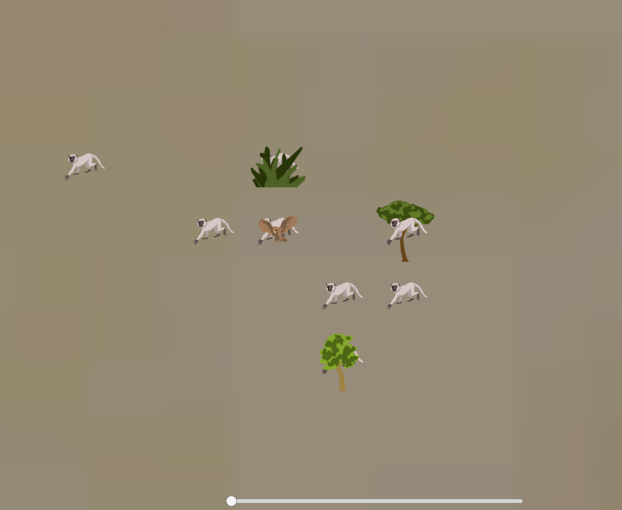

# VervetMonkeys
An Artificial Inteligence Expirement using Reinforcement Learning.

</img>
This is an implementation in Unity of the experiment proposed in:
"Comunicação Simbólica entre Criaturas Artificiais: um experimento em Vida Artificial", by "Angelo Conrado Loula", January 2004.

You can Find the C# Classes in Assets/Scripts/
